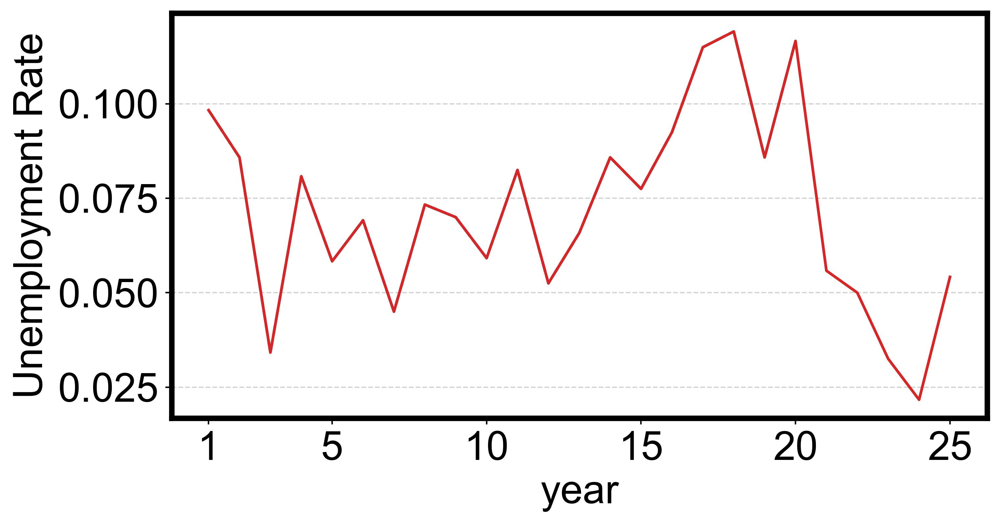
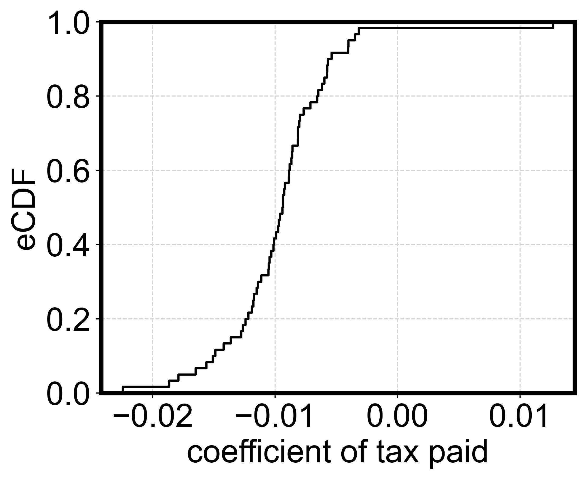
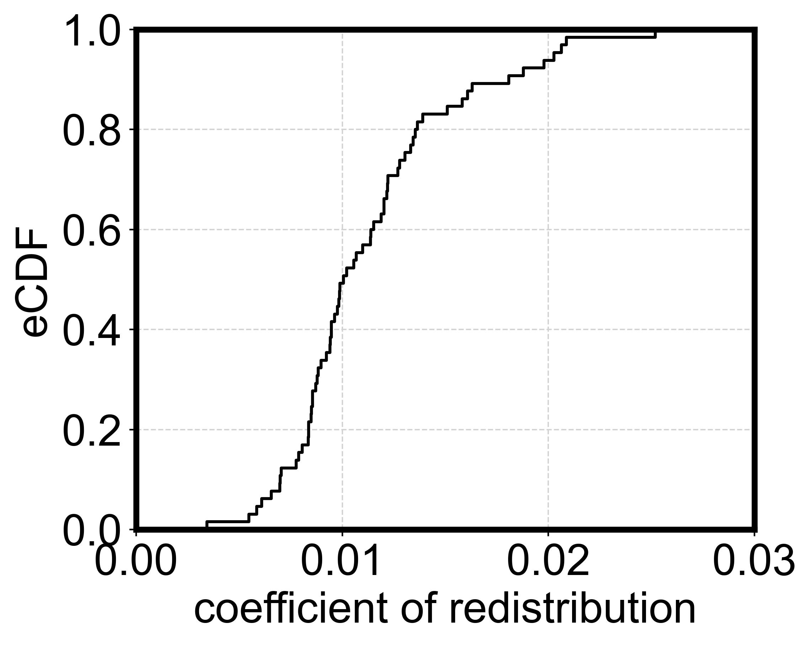
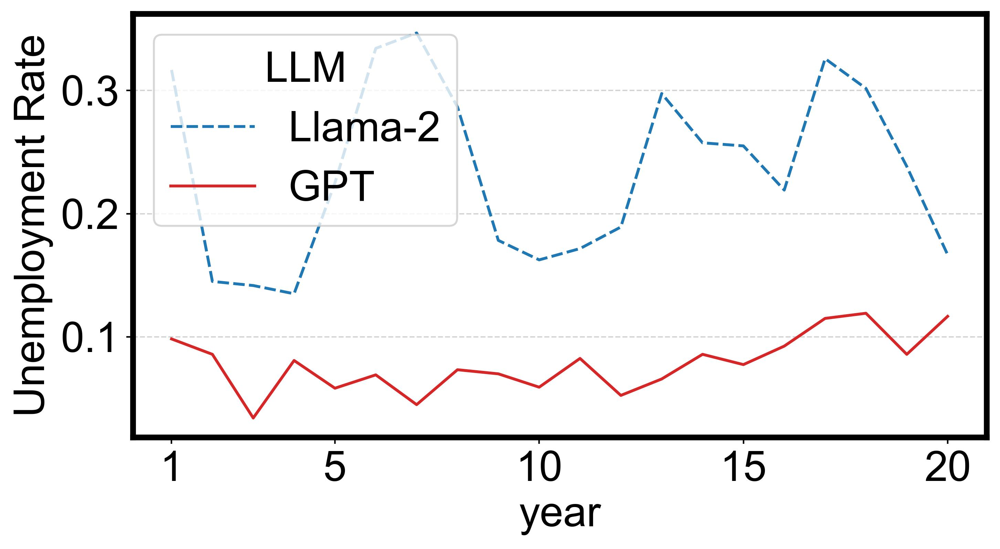
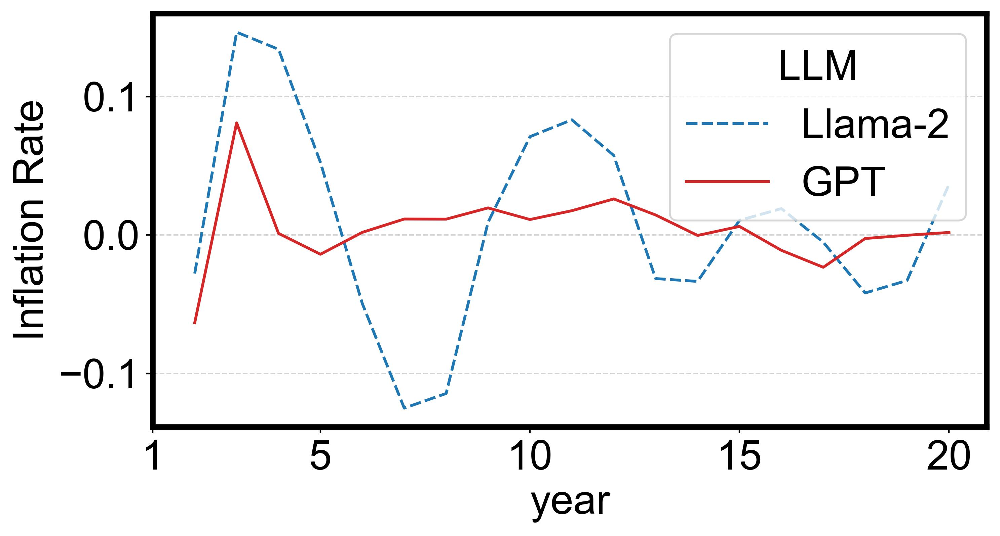
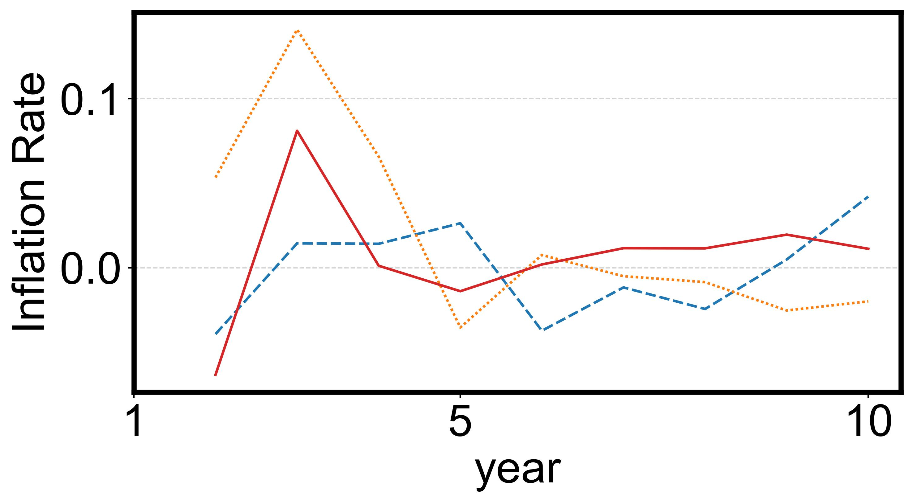
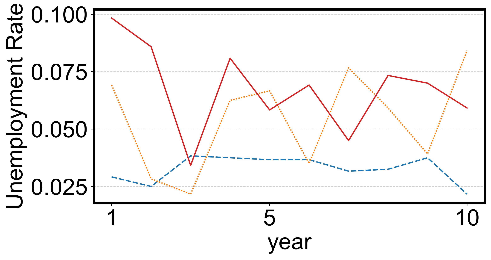
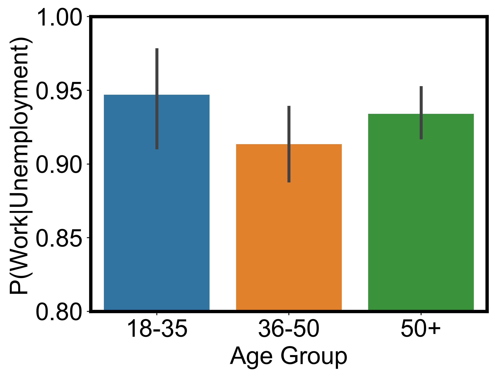

## Response: Increase in the unemployment rate in year 20
<figure>
  
  <figcaption style="text-align: center;">unemployment rate (additional 5 years)</figcaption>
</figure>

## Response: eCDF of tax paid and redistribution
<figure>
  
  <figcaption style="text-align: center;">coefficients of tax paied</figcaption>
</figure>
<figure>
  
  <figcaption style="text-align: center;">coefficients of redistribution</figcaption>
</figure>

## Response: Sensitivity, scalability, and reproducibility
<figure>
  
  <figcaption style="text-align: center;">unemployment rate by Llama-2</figcaption>
</figure>
<figure>
  
  <figcaption style="text-align: center;">inflation rate by Llama-2</figcaption>
</figure>
<figure>
  
  <figcaption style="text-align: center;">Phillips Curve by Llama-2</figcaption>
</figure>

## Response: Ablation study on LLM modules & Technical definitions of agents abilities
<figure>
  
  <figcaption style="text-align: center;">inflation rate</figcaption>
</figure>
<figure>
  
  <figcaption style="text-align: center;">unemployment rate</figcaption>
</figure>

## Response: Correlations between agents' age and job
<figure>
  
  <figcaption style="text-align: center;">P(Work|Uemployment) for agents with different ages</figcaption>
</figure>